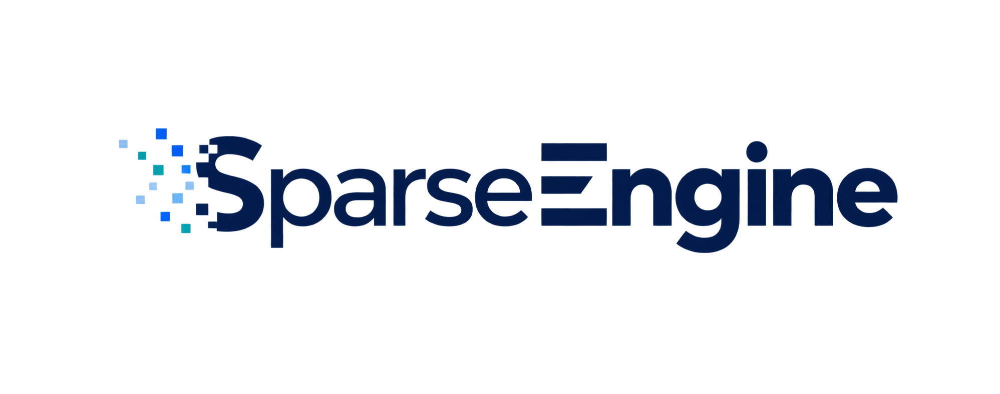
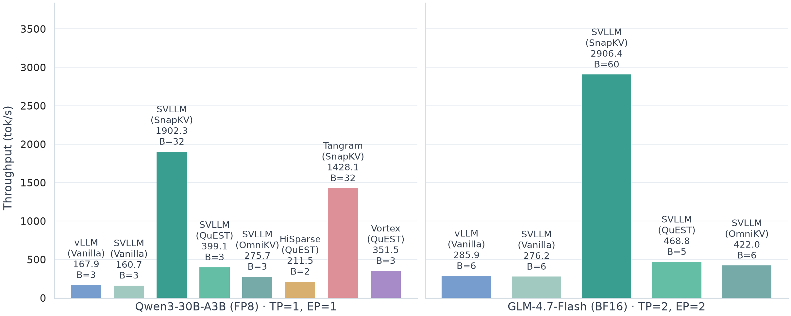

<div align="center">
  

  <p>
    <a href="https://deepwiki.com/CURRENTF/SparseEngine"></a>
    <a href="https://arxiv.org/abs/2602.08005"></a>
    <a href="https://arxiv.org/pdf/2602.08005.pdf"></a>
  </p>
</div>

<p align="center">English | <a href="README_zh.md">简体中文</a></p>

A sparse-first inference engine for long-context LLM serving.

<div align="center">
  
</div>

## Project Overview

SparseEngine is an inference framework built with sparsity as the first design principle. Instead of layering sparse methods on top of a conventional KV cache, it rethinks cache layout, controller flow, and kernels so that multiple sparse mechanisms can plug in cleanly.

> **Note:** DeltaKV compressor training code is maintained separately in
> [CURRENTF/DeltaKV](https://github.com/CURRENTF/DeltaKV). This repository only
> keeps the native DeltaKV inference implementation under `src/sparseengine/`;
> it does not include DeltaKV training code or an HF reference implementation.

## Key Runtime Principles

- Runtime parameter names are identical across `LLM(...)`, `Config`, JSON
  configs, benchmark manifests, and internal consumers. Use `sparse_method`
  everywhere; legacy field aliases are not accepted.
- Sparse method runtime state belongs in
  `src/sparseengine/engine/cache_manager/`; `attention.py` should stay generic.
- Prefill scheduling is method-specific and registry-owned. The source of
  truth is `src/sparseengine/method_registry.py`, not benchmark scripts.
- SparseEngine currently uses two prefill policies: `all_chunked` and the
  special `long_bs1full_short_batch` policy.
- `long_bs1full_short_batch` is only for methods that are registered to need a
  complete long-prefill pass before their sparse/cache transformation. Long
  requests run as full prefill with batch size 1; short requests still use
  chunked batching.
- Benchmark reports should record the sparse method, prefill policy, prefill
  chunk size, prompt length, batch size, and any DeltaKV checkpoint.

## Core Sparse Methods

SparseEngine supports physical eviction, logical masking, query-aware selection,
and hybrid KV compression. The main method families are `streamingllm`,
`snapkv`, `h2o`, `pyramidkv`, `omnikv`, `quest`, and `deltakv`.

| Method | Type | Short Description |
| --- | --- | --- |
| `vanilla` | Dense baseline | Runs full attention and keeps the standard KV cache behavior for correctness and performance baselines. |
| `streamingllm` / `attention-sink` | Physical eviction | Keeps fixed sink tokens plus a recent window, then physically evicts older tokens outside that policy. |
| `snapkv`, `pyramidkv` | Physical eviction | Selects important historical tokens during prefill/finalization and stores only the retained KV tokens. |
| `h2o` | Physical eviction | Maintains independent cumulative attention importance for every layer, then physically compacts each layer's KV rows using its own heavy-hitter selection plus a recent suffix. |
| `omnikv` | Logical masking | Keeps tokens in storage but masks the attention read view so sparse layers attend only selected context. |
| `quest` | Query-aware selection | Uses decode-time query-aware page selection while keeping prefill dense. |
| `deltakv` / `deltakv-*` | Hybrid compression | Keeps a small full-precision pool and stores older context through DeltaKV compression or related ablations. |

Prefill acceleration is an independent axis: `h2o_prefill` compacts KV between
prompt chunks, while `flashprefill_v2` sparsifies prefill attention
computation. Both are selected with `prefill_sparse_method` and combined with a
compatible `sparse_method` for cache/decode behavior.

Read the method overview and integration rules in
[Core Sparse Methods](docs/en/features/sparse-methods.md).

## Supported Models

| Model | Supported |
| --- | :---: |
| Qwen2.5 | ✅ |
| Qwen3 | ✅ |
| Qwen3MoE | ✅ |
| Qwen3.5 / 3.6 / 3.8 | ✅ |
| Qwen3.5 / Qwen3.6 MoE | ✅ |
| GLM-4.7-Flash | ✅ |
| Gemma 4 Dense / MoE | ✅ |
| Llama 3 / 3.1 | ✅ |
| MiniMax M2.7 | ✅ |

See [Supported Models](docs/en/features/supported-models.md) for the precision,
parallelism, and sparse-method compatibility matrices.

Native image, video, and audio inputs are enabled per checkpoint with
`enable_multimodal=True`; see the supported-model matrix for media coverage.

## Documentation

| Topic | Link |
| --- | --- |
| Quick setup and minimal usage | [Getting Started](docs/en/getting_started/README.md) |
| Model, precision, and parallelism support | [Supported Models](docs/en/features/supported-models.md) |
| Sparse method taxonomy and extension rules | [Core Sparse Methods](docs/en/features/README.md) |
| Runtime architecture | [Architecture](docs/en/design/README.md) |
| Runtime parameter semantics | [Runtime Parameter Semantics](docs/en/configuration/runtime-parameter-semantics.md) |
| Benchmark commands | [Benchmarks](docs/en/benchmarking/README.md) |
| DeltaKV inference | [DeltaKV](docs/en/features/deltakv.md) |
| Reproducibility checklist | [Reproducibility](docs/en/getting_started/reproducibility.md) |

The full documentation index is maintained in [docs/en/README.md](docs/en/README.md).

## Quick Start

SparseEngine requires Python 3.10 or newer. The canonical CUDA 13 development
environment uses Python 3.12. Default dependencies are declared in
`pyproject.toml`.

### Conda

```bash
conda create -n sparseengine-cu130-py312 python=3.12 -y
conda activate sparseengine-cu130-py312

python -m pip config --site set global.extra-index-url \
  "https://download.pytorch.org/whl/cu130 https://flashinfer.ai/whl"
python -m pip install "transformers==5.13.1" -e ".[cu130]"
python -m pip check
```

### uv

```bash
uv venv --python 3.12
source .venv/bin/activate

uv pip install -e ".[cu130]"
```

Use `cu129` instead of `cu130` for CUDA 12.9.

### Optional dependencies

After installing the base environment, add these packages as needed.

**FlashInfer JIT Cache** provides precompiled kernel caches to reduce compilation overhead on first use.

```bash
pip install flashinfer-jit-cache --index-url https://flashinfer.ai/whl/cu130
```

**DeepEP V1** provides the NVLink MoE communication backend selected by `moe_backend="deepepv1"` and builds against the installed PyTorch/CUDA environment.

```bash
pip install --no-build-isolation -e ".[deepepv1]"
```

For the full dependency list and a minimal `LLM(...)` example, see
[Getting Started](docs/en/getting_started/README.md).

## Benchmarks

Use `scripts/benchmarks/bench_sparse_engine.py` for throughput measurements and
the `benchmark/` entrypoints for LongBench, MathBench, SCBench, NIAH, and
multimodal evaluations.

See [Benchmarks](docs/en/benchmarking/README.md) for command examples and backend notes.

## Contributing Sparse Methods

New sparse methods should keep persistent physical cache state in
`src/sparseengine/engine/cache_manager/`, keep logical orchestration behind a
`SparseMethodRuntime`, and keep `src/sparseengine/layers/attention.py` generic.
See the [sparse method runtime architecture](docs/en/design/sparse-method-runtime.md).


## Acknowledgements

This project is inspired by and/or references ideas and implementation techniques from:

- `LightLLM` (`ModelTC/LightLLM`)
- `SGLang` (`sgl-project/sglang`)
- `ShadowKV` (`ByteDance-Seed/ShadowKV`)
- `nano-vllm` (`GeeeekExplorer/nano-vllm`)

## License

[Apache License 2.0](LICENSE)

## Citation
```text
@article{hao2026deltakv,
  title={DeltaKV: Residual-Based KV Cache Compression via Long-Range Similarity},
  author={Hao, Jitai and Huang, Qiang and Wang, Yaowei and Zhang, Min and Yu, Jun},
  journal={arXiv preprint arXiv:2602.08005},
  year={2026}
}

@inproceedings{hao2025omnikv,
  title={Omnikv: Dynamic context selection for efficient long-context llms},
  author={Hao, Jitai and Zhu, Yuke and Wang, Tian and Yu, Jun and Xin, Xin and Zheng, Bo and Ren, Zhaochun and Guo, Sheng},
  booktitle={The Thirteenth International Conference on Learning Representations},
  year={2025}
}
```
