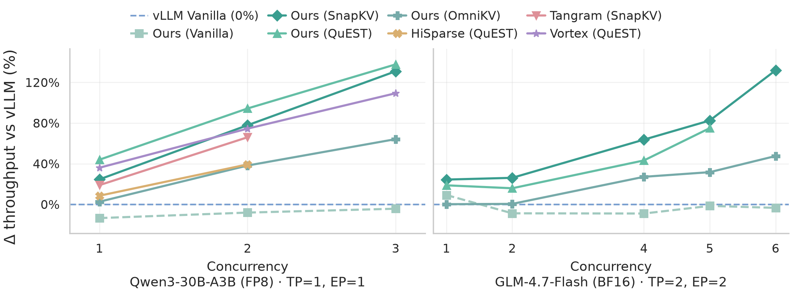

<div align="center">
  

  <p>
    <a href="https://deepwiki.com/CURRENTF/SparseEngine"></a>
    <a href="https://arxiv.org/abs/2602.08005"></a>
    <a href="https://arxiv.org/pdf/2602.08005.pdf"></a>
  </p>
</div>

<p align="center"><a href="README.md">English</a> | 简体中文</p>

SparseEngine 是一个面向长上下文大语言模型服务、以稀疏机制为首要设计原则的推理引擎。

<div align="center">
  
  
</div>

H100 80GB，128K 输入 / 2K 输出。从上到下依次展示：各方法最大已测批量下的解码吞吐量，以及相同并发数下相对 vLLM Vanilla 的吞吐量提升（vLLM 为 0% 基线）。
图中的 Ours 指 SparseEngine。详见[测量口径与图表说明](scripts/official_experiments/sparse_decode_efficiency/README.md#readme-figures)。

## 项目概览

SparseEngine 是一个从设计之初就以稀疏性为核心原则的推理框架。它并非简单地在传统 KV 缓存之上叠加稀疏方法，而是重新设计缓存布局、控制流程和内核，使多种稀疏机制能够清晰地接入框架。

> **说明：** DeltaKV 压缩器训练代码由独立仓库
> [CURRENTF/DeltaKV](https://github.com/CURRENTF/DeltaKV) 维护。本仓库仅保留
> `src/sparseengine/` 下的原生 DeltaKV 推理实现，不包含 DeltaKV 训练代码或
> Hugging Face reference implementation。

## 核心运行原则

- `LLM(...)`、`Config`、JSON 配置、benchmark manifest 与内部代码使用完全相同的 runtime 参数名。统一使用 `sparse_method`；旧字段 alias 不再接受。
- 稀疏方法的运行时状态应放在 `src/sparseengine/engine/cache_manager/` 中；`attention.py` 应保持通用。
- 预填充调度由各方法自行定义并通过注册表管理。其唯一事实来源是 `src/sparseengine/method_registry.py`，而不是基准测试脚本。
- SparseEngine 当前使用两种预填充策略：`all_chunked` 和特殊的 `long_bs1full_short_batch` 策略。
- `long_bs1full_short_batch` 仅适用于注册时声明需要在稀疏化或缓存转换前完成一次完整长预填充的方法。长请求以批大小 1 执行完整预填充，短请求仍使用分块批处理。
- 基准测试报告应记录稀疏方法、预填充策略、预填充分块大小、提示词长度、批大小以及所用的 DeltaKV 检查点。

## 核心稀疏方法

SparseEngine 支持物理淘汰、逻辑掩码、查询感知选择和混合 KV 压缩。主要方法系列包括 `streamingllm`、`snapkv`、`h2o`、`pyramidkv`、`omnikv`、`quest` 和 `deltakv`。

| 方法 | 类型 | 简介 |
| --- | --- | --- |
| `vanilla` | 稠密基线 | 执行完整注意力计算并保留标准 KV 缓存行为，作为正确性和性能基线。 |
| `streamingllm` / `attention-sink` | 物理淘汰 | 保留固定的注意力汇聚 token 和最近窗口，并物理淘汰策略范围之外的旧 token。 |
| `snapkv`、`pyramidkv` | 物理淘汰 | 在预填充或收尾阶段选择重要的历史 token，仅存储保留下来的 KV token。 |
| `h2o` | 物理淘汰 | 为每层分别维护累计 attention importance，并使用该层自己的 heavy-hitter 选择与 recent 后缀物理压缩 KV row。 |
| `omnikv` | 逻辑掩码 | 保留存储中的 token，但对注意力读取视图进行掩码，使稀疏层仅关注选定的上下文。 |
| `quest` | 查询感知选择 | 保持预填充阶段为稠密计算，在解码阶段使用查询感知的分页选择。 |
| `deltakv` / `deltakv-*` | 混合压缩 | 保留一个小型全精度池，并通过 DeltaKV 压缩或相关消融方法存储较早的上下文。 |

方法概览和集成规则请参阅[核心稀疏方法](docs/zh/features/sparse-methods.md)。

## 支持的模型

| 模型 | 是否支持 |
| --- | :---: |
| Qwen2.5 | ✅ |
| Qwen3 | ✅ |
| Qwen3MoE | ✅ |
| Qwen3.5 / 3.6 / 3.8 | ✅ |
| Qwen3.5 / Qwen3.6 MoE | ✅ |
| Llama 3 / 3.1 | ✅ |
| MiniMax M2.7 | ✅ |

各模型支持的精度、并行方式和稀疏方法请参阅
[支持的模型](docs/zh/features/supported-models.md)。

## 文档

| 主题 | 链接 |
| --- | --- |
| 快速配置与最小用法 | [快速开始](docs/zh/getting_started/README.md) |
| 模型、精度与并行支持 | [支持的模型](docs/zh/features/supported-models.md) |
| 稀疏方法分类与扩展规则 | [核心稀疏方法](docs/zh/features/README.md) |
| 运行时架构 | [架构](docs/zh/design/README.md) |
| 运行时参数语义 | [运行时参数语义](docs/zh/configuration/runtime-parameter-semantics.md) |
| 基准测试命令 | [基准测试](docs/zh/benchmarking/README.md) |
| DeltaKV 推理 | [DeltaKV](docs/zh/features/deltakv.md) |
| 可复现性检查清单 | [可复现性](docs/zh/getting_started/reproducibility.md) |

完整文档索引维护在 [docs/zh/README.md](docs/zh/README.md) 中。

## 快速开始

SparseEngine 需要 Python 3.10 或更高版本，默认依赖声明在
`pyproject.toml` 中。

### Conda

```bash
conda create -n sengine python=3.10 -y
conda activate sengine

CUDA_VERSION=cu130
python -m pip config --site set global.extra-index-url \
  "https://download.pytorch.org/whl/${CUDA_VERSION} https://flashinfer.ai/whl"
python -m pip install -e ".[${CUDA_VERSION}]"
```

### uv

```bash
uv venv --python 3.10
source .venv/bin/activate

uv pip install -e ".[cu130]"
```

CUDA 12.9 环境将 `cu130` 换成 `cu129`。

### 可选安装

完成基础环境安装后，可按需安装以下依赖。

**FlashInfer JIT Cache**：提供预编译算子缓存，减少首次使用时的编译开销。

```bash
pip install flashinfer-jit-cache --index-url https://flashinfer.ai/whl/cu130
```

**DeepEP V1**：为 `moe_backend="deepepv1"` 提供 NVLink MoE 通信，在已安装的 PyTorch/CUDA 环境中构建。

```bash
pip install --no-build-isolation -e ".[deepepv1]"
```

完整依赖列表和最小 `LLM(...)` 示例请参阅[快速开始](docs/zh/getting_started/README.md)。

## 基准测试

使用 `scripts/benchmarks/bench_sparse_engine.py` 测量吞吐量，并通过 `benchmark/` 下的入口进行 LongBench、MathBench、SCBench、NIAH 和多模态评测。

命令示例和后端说明请参阅[基准测试](docs/zh/benchmarking/README.md)。

## 贡献稀疏方法

新增稀疏方法应将方法专用的运行时状态保存在 `src/sparseengine/engine/cache_manager/` 中，并保持 `src/sparseengine/layers/attention.py` 的通用性。

## 致谢

本项目受到以下项目的启发，并参考了其中的理念和实现技术：

- `LightLLM` (`ModelTC/LightLLM`)
- `SGLang` (`sgl-project/sglang`)
- `ShadowKV` (`ByteDance-Seed/ShadowKV`)
- `nano-vllm` (`GeeeekExplorer/nano-vllm`)

## 许可证

[Apache License 2.0](LICENSE)

## 引用

```text
@article{hao2026deltakv,
  title={DeltaKV: Residual-Based KV Cache Compression via Long-Range Similarity},
  author={Hao, Jitai and Huang, Qiang and Wang, Yaowei and Zhang, Min and Yu, Jun},
  journal={arXiv preprint arXiv:2602.08005},
  year={2026}
}

@inproceedings{hao2025omnikv,
  title={Omnikv: Dynamic context selection for efficient long-context llms},
  author={Hao, Jitai and Zhu, Yuke and Wang, Tian and Yu, Jun and Xin, Xin and Zheng, Bo and Ren, Zhaochun and Guo, Sheng},
  booktitle={The Thirteenth International Conference on Learning Representations},
  year={2025}
}
```

如果 SparseEngine 帮到了你，请在 [GitHub 点个 Star](https://github.com/CURRENTF/SparseEngine)，这对我们意义重大。
