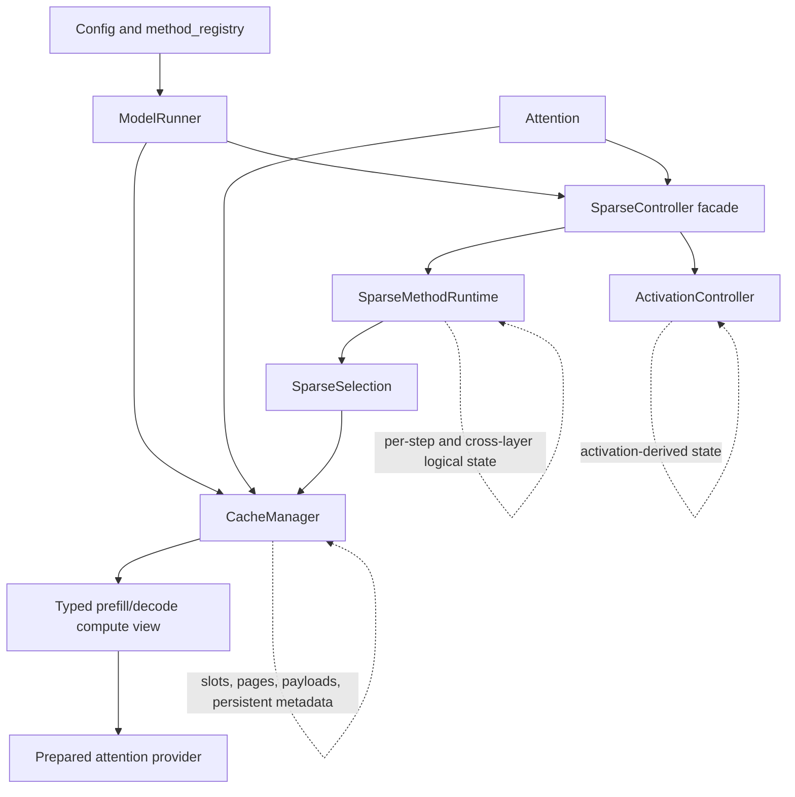

# Sparse Method Runtime Architecture

This document defines the control-plane boundary for first-class sparse methods
in SparseEngine. It is the architectural contract for adding a method, refactoring
an existing method, or integrating a model with native dynamic sparse attention.

The central rule is:

> A cache manager owns persistent physical cache state. A sparse method runtime
> owns logical score and selection orchestration. `SparseController` is the
> method-agnostic facade connecting those components to the inference engine.

This separation lets each method use a native storage and execution path without
adding method branches to the shared attention or scheduling hot paths.

## Architecture At A Glance



There are two stable interfaces:

1. The engine calls one `SparseController` interface regardless of method.
2. The controller delegates method semantics to one `SparseMethodRuntime`.

The cache manager remains a separate physical-storage abstraction. Runtime and
cache-manager inheritance are not required to match.

Decode batches may contain different request lengths. Each method uses per-row
lengths to score, select, or compact valid KV entries. Rows that fit a method's
effective retention budget keep all available KV entries, even when they execute
scoring and selection. CUDA Graph capture
uses one family per batch bucket with `max_model_len` capacity. Growing a request
across a sparse budget does not change graph identity. Prefill execution-mode and
compatibility grouping remain separate.

OmniKV decode selection consumes device-side candidate lengths directly. Rows
whose history fits the keep budget retain all history without score reduction
or top-k scanning. Longer rows reduce and select only valid history; unused
score tails are undefined and must not be read. Provider output order may differ,
but selected logical indices and physical slots must stay paired. The static
capture capacity and graph identity remain unchanged.

## Ownership Boundaries

| Component | Owns | Must not own |
| --- | --- | --- |
| `method_registry.py` | Canonical names, aliases, score contracts, schedule defaults, model/topology compatibility, prefix-cache and graph support, assets. | Mutable state, buffers, allocation policy. |
| `SparseController` | Stable engine-facing lifecycle, typed request/event construction, delegation to runtime and activation control. | Method-name hot-path branches or method algorithms. |
| `SparseMethodRuntime` | Per-step/per-layer logical state, score-buffer orchestration, cross-layer observation, logical selection, and compression/eviction triggers. | Physical slot ownership or persistent prefix-coupled cache metadata. |
| `ActivationController` | Hidden-state capture, activation reuse, and activation-derived cross-layer behavior. | KV allocation and physical cache views. |
| `CacheManager` | Physical KV or latent storage, slots/pages/pools, persistent method metadata, allocation, compaction, reconstruction, prefix lifecycle, and typed compute-view construction. | Scheduler policy or model-layer method branches. |
| `MemoryOracle` / `RuntimeState` | Capacity, reservation, execution-mode, and admission facts exposed to scheduling. | Method algorithms. |
| `Attention` | Generic store, view request, provider invocation, and lifecycle hooks. | Sparse-method names, policy, or persistent state. |
| Operator/provider | Prepared compute implementation and workspaces for its declared typed contract. | Method policy, cache allocation, or silent semantic fallback. |

State ownership is determined by lifetime and semantics, not convenience:

- If state must survive append, prefix attach, fork, restore, rollback, offload,
  or free, it is cache-coupled persistent state and belongs in `CacheManager`.
- If state is rebuilt for the current forward step or propagates a selection
  between layers, it belongs in `SparseMethodRuntime`.
- If state is derived from hidden activations rather than cache payloads, it
  belongs in `ActivationController`.
- If a decision affects admission or batching, expose it through a generic
  scheduler-facing contract rather than reading the method name.

## The Public Controller Facade

`src/sparseengine/engine/sparse_controller.py` intentionally stays small. Its
engine-facing lifecycle is:

```python
class SparseController:
    def prepare_forward(self, seqs, is_prefill): ...
    def get_prefill_selection(self, layer_idx): ...
    def get_decode_selection(self, layer_idx, query): ...
    def on_layer_attention_end(self, layer_idx): ...
    def on_layer_end(self, layer_idx, context): ...
    def post_forward(self, seqs, is_prefill): ...
```

It also combines activation/runtime CUDA Graph keepalive state, resets runtime
score buffers for capture, exposes debug summaries, and forwards tokenizer
metadata to `ActivationController`.

Do not add a branch such as `if sparse_method == ...` to this facade. A method
change should be represented by a runtime implementation, a typed cache-manager
hook, or another narrow owner-specific interface.

## The Method Runtime Contract

`src/sparseengine/engine/sparse_methods/base.py` defines typed lifecycle inputs:

- `SparseStepContext`
- `PrefillSelectionRequest`
- `DecodeSelectionRequest`
- `AttentionEndEvent`
- `LayerEndEvent`

`SparseMethodRuntime` provides common per-layer state preparation and score
workspace behavior. Implementations define the semantic hooks they need:

| Hook | Timing | Responsibility |
| --- | --- | --- |
| `prepare_step` | Before model layers | Refresh current batch metadata and prepare score/selection workspaces. |
| `needs_attention_score` | During preparation | Declare whether a layer needs a score buffer for this step. |
| `build_prefill_selection` | Before prefill attention | Produce the logical selection consumed by the cache manager. |
| `build_decode_selection` | Before decode attention | Produce the logical selection; the current query is available when needed. |
| `on_attention_end` | Immediately after attention | Finalize score materialization that depends on attention completion. |
| `on_layer_end` | At the model layer boundary | Normalize scores and propagate cross-layer selections. |
| `finish_step` | After model forward | Trigger method-owned logical finalization or cache-manager physical mutation. |
| graph/debug hooks | Capture, replay, diagnostics | Preserve workspace identity, reset captured inputs, and expose logical state. |

`LayerBatchSparseState` is current-step logical state. It may reference stable
cache-manager tensors, but it does not take ownership of their physical
lifetime.

## Runtime Construction And Reuse

`engine/sparse_methods/factory.py` maps the resolved physical cache method to a
runtime class at construction time. Usually this is `sparse_method`; the
exception is `prefill_sparse_method="h2o_prefill"`, which resolves H2O
cache/runtime ownership even with vanilla decode. Runtime dispatch must not
perform registry lookup or method string selection inside the per-layer hot
path.

The runtime hierarchy is deliberately shallow and organized by shared
mechanics:

For `omnikv_prefill`, the factory wraps the existing vanilla/OmniKV runtime
in `PrefillOverrideRuntime`. The wrapper binds an `OmniKVPrefillRuntime` for
prefill and retains the original runtime for decode. It returns to decode state
at `finish_step`, before graph replay restores captured references without
running `prepare_step`. This exclusive delegation is deliberately limited to
decoders without prefill score/compaction obligations.

Chain mode retains Standard/OmniKV's shared physical slot pool across turns.
Its per-layer residency counts repeat the shared allocation length; admission
uses the maximum reserved count rather than summing independent pools. The chain
fingerprint includes prefill observers, budgets and chunk limits. Radix remains
invalid because a chunk's later queries can affect earlier tokens' deeper-layer KV.
OmniKV offload reuses its existing prefill gather: selected history comes from
host backing and the complete current chunk comes directly from GPU tensors.
Selection tables keep current tokens at the tail, preserving that gather contract.

The prefill runtime reuses `context_attention_fwd`'s causal raw-QK sums, takes
the maximum over heads after dividing by query count, and performs an attention
TP MAX reduction before selecting history. `build_omnikv_keep_and_slots` builds
the shared logical view; full physical KV remains untouched. The operator's
optional-score contract prepares scored and unscored providers before execution,
keeping ordinary attention on the upstream-first portfolio. The inspected SGL
context kernel and vLLM FA attention interface do not expose this per-head
raw-QK sum; attention output/LSE alone does not satisfy that score contract.

MLA instead uses the existing chunked prefill raw-QK query/head maximum scorer.
The view's float32 `[B, L]` output becomes a full-current-query score request;
history scoring reuses each bounded block's expanded K and resets the shared
atomic-max buffer to negative infinity between observers. Gemma 4 uses its
existing per-head raw-QK scorer only on global layers. Eligibility follows
logical KV consumers, including shared-KV aliases, and skips sliding-window
layers without resetting the preceding global observer. Sliding layers therefore
retain their full position domain and need no sparse window-mask adaptation.

For batch `B`, local query heads `H`, context `L`, chunk `C`, selected history
budget `K`, and head dimension `D`, each observation costs `O(B H C L D)`
attention work plus reduction/selection over `B H L` scores. Following layers
read at most `sink + K + recent + C` tokens. A shared float32 score buffer costs
`4 B H L` bytes; reduced scores cost `4 B L`, and each observation interval retains
two int32 selection tables of at most `8 B (sink + K + recent + C)` bytes total,
plus row lengths and top-k workspace. For `B=8, H=32, L=32768`, the shared score
buffer is 32 MiB. Startup prefill profiling includes these allocations. Scores
are reset between observations and released at the step boundary; no full QK
matrix or new persistent KV pool is allocated. Long-context savings depend on
the number of observation layers and chunk/budget settings and require measurement.

| Runtime mechanism | Current methods | Meaning |
| --- | --- | --- |
| `PassThroughRuntime` | vanilla, QuEST | Controller selection is full; any native query-aware physical view remains cache-manager/provider owned. |
| `StreamingLLMRuntime` | StreamingLLM | Pass-through attention view followed by physical sink/recent retention. |
| `ScoredCompactionRuntime` | SnapKV, PyramidKV | Shared score lifecycle and physical compaction; PyramidKV specializes layer budgets and triggers. |
| `H2ORuntime` | H2O prefill and/or H2O decode | Prompt-score workspace and independent prefill/final-prompt compaction; optional decode probability accumulation and periodic eviction. |
| `JointDecodeRuntime` | SkipKV | Layer-local joint-score decode compaction. |
| `RKVRuntime` | R-KV | Cross-head mean, cross-layer sum and attention-TP reduction followed by one global selection. |
| `DynamicSelectionRuntime` | OmniKV, DeltaKV | Observation-layer scoring and cross-layer dynamic selection; physical payload semantics remain method-specific. |

The optional H2O decode switch reuses the existing scoring kernels: prefill
probability scores reduce query observations per head and then take a head-wise
maximum, whereas decode probabilities are summed across query heads. Forcing
probability mode avoids mixing raw logits with probabilities; it does not unify
these head reductions or establish original-H2O scoring parity. MLA decode is
an explicit approximation: providers output head-max raw QK, then the H2O
runtime requests softmax normalization and accumulation over retained tokens.
It uses the existing reduced-score workspace and eviction lifecycle, regardless
of the explicit-KV headwise score-fusion setting; a TODO and one-time warning
mark the missing per-head probability parity.

Explicit-KV H2O score fusion keeps one provider-owned `[batch, heads, capacity]`
raw-QK workspace, shared by sequential layers and graph executions. Each layer
immediately converts its logits using attention's natural-log LSE, sums over
heads, and writes its own `[batch, capacity]` probability output before the next
layer reuses the workspace. Only reduced scores survive to `finish_step`, where
history accumulation and physical eviction remain cache-manager-owned. This
removes layer- and graph-multiplied raw-logit storage without changing scoring
or eviction policy; captured pointers and launch capacities stay fixed.

Subclass a runtime only when its score representation, trigger order, selection
domain, mutation order, prefix behavior, and CUDA Graph workspace lifecycle
actually match. Otherwise add a separate runtime and share only a narrow helper.

Cache managers use their own inheritance structure because physical allocation,
storage layout, prefix lifecycle, and `MemoryOracle` behavior form a different
axis of reuse. A runtime class and a cache-manager class do not need a one-to-one
inheritance relationship.

## Selection And Compute-View Boundary

The data plane follows this sequence:

1. Runtime produces a typed `SparseSelection`.
2. `Attention` passes the selection and current query/KV inputs to
   `CacheManager`.
3. `CacheManager` resolves logical indices into physical slots, pages, latent
   payloads, or reconstructed temporary storage.
4. `CacheManager` returns a typed `PrefillComputeView` or `DecodeComputeView`.
5. A prepared provider consumes the view without inspecting the sparse method.

Use the existing data-plane types:

- `SparseSelection` for logical selection;
- `AttentionViewMeta` or `PagedDecodeViewMeta` for physical coordinates;
- `PrefillComputeView` and `DecodeComputeView` for execution-time views;
- `ExplicitKVPayload` and `MlaLatentPayload` for storage payloads.

Do not pass method-specific tuples, config objects, hidden side-channel tensors,
or method names through `layers/attention.py`.

QuEST demonstrates an important case: its runtime returns the ordinary full
logical selection, while `QuestCacheManager` and the selection provider use the
current query to construct the native paged view. The runtime should not copy
persistent page metadata merely to make the method look controller-owned.

## Ordered Submission And Result Retirement

Synchronous and asynchronous execution use the same attention, layer, and
step hooks. `post_forward` and cache `on_forward_end` execute during submission,
before resetting the forward context or preparing another batch. They may
queue GPU work without waiting for completion. CPU-dependent decisions retain
their required waits. Graph replay refreshes activation policy inputs outside
the graph; captured layer hooks keep their existing order.

Result retirement handles copied tokens/logprobs and publishes deferred prefix
records. It must not re-run compute hooks against current-batch mutable state.
Request storage retires only after every outstanding user completes.

A runtime, activation controller, or cache manager that reads uncommitted token
history on the CPU declares `requires_committed_token_history`. The scheduler
retires pending token-producing submissions before scheduling the next batch.
This requirement does not block pipelining intermediate prefill chunks that
produce no output token. GPU-only consumers use ordered device token feedback.

Cache-owned reusable CPU upload buffers use `acquire_step_host_buffer` before
writing. Asynchronous submissions borrow exclusive storage until retirement;
synchronous execution retains its original buffer. GPU graph addresses remain
fixed. Auxiliary-stream owners must join their work before dependent reads or
storage reuse, including the step-end handoff.

## Temporary Prefill Resource Admission

Temporary prefix scoring uses the standard cache manager's
`reserve_prefill_slots` scope. The caller pins the complete cached routes it
needs, then submits ordered `(seq_id, query_tokens)` costs. The manager applies
its normal eviction policy and reserves real slots and rows for the largest
admissible leading batch. The model runner constructs scoring inputs and reduces
scores; it does not interpret the free-slot count or implement eviction policy.
Admission includes CPU-only prefix promotion, counting shared blocks once and
leaving their slots available for the ordinary prefix-attach path.

Reserved slots are consumed by ordinary prefill allocation. Unused reservations
and newly claimed rows are reclaimed on scope exit; consumed KV follows the
normal row lifetime. Prefill, decode and prefix promotion share the physical
slot-taking operation. Existing asynchronous results must retire before this
synchronous maintenance scope begins. A successful reservation does not permit
evicting its protected cached prefixes, including non-candidate suffixes.

## Prefix Cache And CUDA Graph

Prefix-cache support is a physical-state contract, not a controller feature.
Every persistent method tensor must follow the same allocate, append, attach,
fork, restore/rollback, eviction/offload, and free lifecycle as the KV payload it
describes. That ownership remains behind the cache-manager interface.

Runtime logical state is rebuilt from cache-manager batch state after prefix
attachment. A runtime must not retain sequence-owned physical metadata that can
become stale after ownership transfer.

Runtime-owned CUDA Graph buffers are allowed when they are logical score or
selection workspaces. Supported graph runtimes must:

- allocate graph-stable workspaces before capture;
- expose them through `decode_graph_keepalive_tensors`;
- reset captured score inputs through the typed graph reset hook;
- avoid allocation, registry lookup, or Python shape-dependent fallback during
  replay;
- preserve eager and graph selection/output semantics.

## Integrating A New Method Or Native DSA Model

Use this dependency order:

1. Declare canonical identity and static capabilities in config and
   `method_registry.py`.
2. Validate model layout, storage representation, topology, providers, and
   unsupported combinations.
3. Implement persistent physical state and lifecycle behavior in a cache
   manager or storage owner.
4. Select or add a `SparseMethodRuntime` for score/selection orchestration and
   register it in the runtime factory.
5. Return typed selections and compute views across the attention boundary.
6. Expose capacity, temporary reservation, and execution-mode requirements
   through `MemoryOracle`/`RuntimeState`.
7. Integrate activation control or operators only when the declared semantics
   require them.
8. Validate prefix cache and CUDA Graph for every capability advertised by the
   registry.

For a model with native dynamic sparse attention (DSA), first identify whether
the model exposes routed token indices, query-dependent page selection,
compressed/latent payloads, or persistent routing metadata. Route each part to
the same owners:

- model/layout code defines stable operator and storage semantics;
- runtime coordinates logical scoring and cross-layer selection;
- cache manager owns physical storage and persistent metadata;
- provider consumes a typed view or model-native payload;
- scheduler sees only generic capacity and execution constraints.

Do not encode a model-native DSA path as branches in `Attention`, `ModelRunner`,
or `Scheduler`. If the current types cannot express its payload, extend the
narrow typed boundary rather than bypassing it.

## Review And Validation Invariants

A sparse-method change is incomplete until all relevant invariants hold:

- `SparseController`, `Attention`, `ModelRunner`, and `Scheduler` contain no new
  method-name hot-path branches.
- Persistent cache metadata and slot lifetime remain cache-manager owned.
- Runtime factory construction is explicit and auditable.
- Score shape, dtype, fill value, normalization, reduction order, Top-K tie
  behavior, trigger boundary, and mutation order match the method contract.
- Prefix cold/hit/append/fork/restore/free paths are covered where advertised.
- Eager and CUDA Graph paths preserve buffer identity and numerical behavior.
- Deterministic generation matches the reference before quality evaluation.
- Performance uses matched traces, providers, budgets, and validated artifacts
  from the efficiency runbook.

Use the repository-local `$add-sparse-method` skill for the complete integration
and validation workflow.
