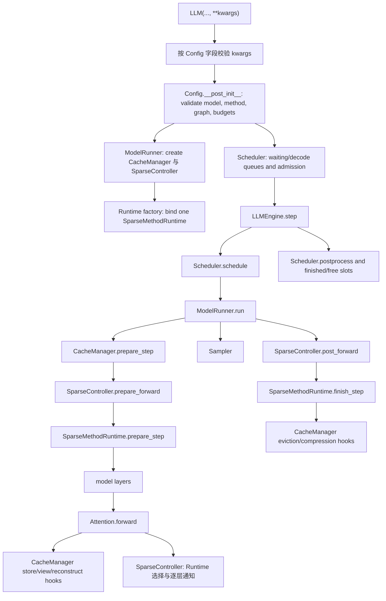

# SparseEngine 控制图

本页展示 SparseEngine runtime 的所有权和 control flow。它不是 benchmark result，不应作为方法声明的证据。请用它判断改动应放在哪里、哪些文档可信，以及报告结果前应运行哪些检查。

## 文档导航

- 选择文档位置时，从 `docs/zh/README.md` 开始。
- 稳定的 runbook 和 contract 位于 `docs/zh/` 下对应主题目录。
- 不要在仓库文档中保存本地 run ledger。报告结果时应记录可复现所需的产物和配置。
- `docs/zh/configuration/runtime-parameter-semantics.md` 是规范参数 contract。添加新的 public run config 前应保持它同步。

## 一句话模型

SparseEngine 是 sparse-first inference engine：`Scheduler` 决定运行什么，
`ModelRunner` 执行，`SparseController` 把具体方法逻辑交给
`SparseMethodRuntime`，`Attention` 只调用通用接口，`CacheManager` 负责物理
缓存、空间分配、计算视图、数据重建和 CUDA Graph 使用的稳定元数据。

对于 SnapKV、H2O、PyramidKV、R-KV 和 SkipKV 的 chain prefix cache，
`ChainCacheIndex` 只负责逻辑生命周期，`ChainCacheCoordinator` 规划状态转换，
cache manager 保留全部 payload/metadata，`RuntimeState` 执行回收。OpenAI
dispatcher 在构造 stream 前确认 admission；smart-router affinity 来自并行的
只读 worker probe，而不是 router 自己维护的 chain map。Rank 0 仅为保持文本
continuation 的准确 BPE identity 而保留紧凑逻辑 token ID；该历史有容量上限，
且不属于物理 KV payload。

## Runtime 流程



## 目录所有权

| 路径 | 角色 | 所有权规则 |
| --- | --- | --- |
| `src/sparseengine/configs/groups.py`, `runtime.py` | 规范 runtime 字段、validation、graph constraint 与方法规范化 default。 | Public 与 internal 字段名必须一致；参数行为同步到 `docs/zh/configuration/runtime-parameter-semantics.md`。 |
| `src/sparseengine/method_registry.py` | 稀疏方法 alias 和默认 prefill policy。 | 新 method string 和 policy default 从这里开始。 |
| `src/sparseengine/engine/llm_engine.py` | Public engine lifecycle、tokenizer、scheduler loop、warmup、吞吐量 logging。 | 不应增加方法特定 runtime 逻辑。 |
| `src/sparseengine/engine/scheduler.py` | Prefill 执行模式分组、混合长度 decode batching、prompt admission、preemption。 | 使用 cache-manager budget hook，不了解方法内部实现。 |
| `src/sparseengine/engine/model_runner.py` | 模型加载、TP RPC、CUDA Graph runner、prepare/run/sample orchestration。 | 负责执行机制，不负责 token-selection policy。 |
| `src/sparseengine/engine/cache_manager/base.py` | Cache-manager interface 和方法 routing。 | 方法特定的 persistent state 属于该 interface 之后。 |
| `src/sparseengine/engine/cache_manager/*.py` | 各稀疏方法的 physical/logical KV state。 | 持久物理方法实现的主要位置。 |
| `src/sparseengine/engine/sparse_controller.py` | 稳定、与方法无关的统一入口。 | 通过统一的 Runtime 请求和通知转交工作；不得增加方法名热路径分支。 |
| `src/sparseengine/engine/sparse_methods/` | Runtime 基类和 factory、当前步骤状态、打分、选择、跨层传递以及压缩/淘汰触发。 | 各方法的逻辑放在这里；长期物理状态仍属于 CacheManager。 |
| `src/sparseengine/layers/attention.py` | 通用 KV store、attention kernel dispatch 和 hook 调用。 | 必要时添加 generic hook；避免方法特定 branch。 |
| `src/sparseengine/kernels/triton/` | 仓库维护的 Triton kernel。 | shape/dtype 假设无效时，kernel wrapper 应快速失败。 |
| `src/sparseengine/kernels/tilelang/` | 仓库维护的 TileLang kernel 和 runtime binding。 | 编译和 launch 细节不能放入 operators。 |
| `src/sparseengine/kernels/external/` | 第三方 kernel 库的薄适配。 | 可选依赖保持惰性导入，并校验支持的 API 版本。 |
| `benchmark/model_adapters/sparseengine.py` | 文本 benchmark 共用的原生 generation adapter。 | 保持轻量；runtime 行为属于 `src/sparseengine/`。 |
| `benchmark/` 和 `scripts/` | 评估、调试、分析和吞吐量脚本。 | 分别保存 raw output、parsed output、per-sample status、aggregate metric 和 run info。 |

## 方法类别

| 类别 | SparseEngine 方法名 | 核心行为 | 主要文件 |
| --- | --- | --- | --- |
| Dense | `vanilla` / `""` | 完整 KV cache，无 sparse selection。 | `standard.py`、通用 attention path |
| Streaming window | `streamingllm`, `attention-sink`, `attention_sink` | 物理淘汰，只保留 sink 加 recent token。 | `streamingllm.py`、`standard.py` 风格机制 |
| SnapKV / PyramidKV | `snapkv`, `pyramidkv` | 基于 score 的 keep selection 后执行 physical eviction；PyramidKV 改变 per-layer budget。 | `cache_manager/methods/snapkv.py`, `sparse_methods/snapkv.py` |
| OmniKV | `omnikv` | 根据 observation-layer score 构建 logical mask/view。`full_attention_layers=auto` 会解析可与 DeltaKV 共享的模型 profile；未登记模型应使用 `python -m sparseengine.utils.select_omnikv_full_layers` 校准。 | `cache_manager/methods/omnikv/manager.py`, `sparse_methods/dynamic.py`, `omnikv_fused.py` |
| QuEST | `quest` | Query-aware decode page/chunk selection；持久 page metadata 和原生 view 构造仍由 CacheManager/provider 持有。 | `cache_manager/methods/quest.py`, `sparse_methods/passthrough.py` |
| DeltaKV | `deltakv` | 基于 compressor 的 hybrid cache：sparse full/reference pool 加 compressed latent state；已登记模型可与 OmniKV 共用 `full_attention_layers=auto` profile。 | `cache_manager/methods/deltakv*.py`, `sparse_methods/dynamic.py`, `deltakv_kernels.py` |

## 状态所有权 Contract

- `Sequence` 持有 request-local counter：prompt length、prefilled length、当前 chunk size、generated token 数和 finished status。
- `Scheduler` 持有 queue membership 和 admission decision。它必须向 cache manager 查询 cost、budget 和 full-prefill routing。
- `CacheManager` 持有 physical slot、row map、full/sparse pool、compressed length、graph-stable metadata、临时 reconstruction slot 和方法 allocation 算术。
- `SparseMethodRuntime` 持有当前步骤的逐层逻辑状态，并把选中位置传给后续层。
  它不应持有长期缓存元数据。
- `SparseController` 只提供稳定的引擎入口，并通过统一的 Runtime 请求和通知转交
  具体方法逻辑。
- `Attention` 不持有 policy 或 persistent state。它存储当前 K/V、请求 read view、运行 generic prefill/decode kernel，并调用 layer-end hook。
- CUDA Graph runner 持有 graph capture/replay 机制；cache manager 提供 graph-stable buffer 和 plan reference。

## 当前最难控制的位置

| 文件 | 难点 | 处理方式 |
| --- | --- | --- |
| `src/sparseengine/engine/cache_manager/methods/deltakv_less_memory.py` | 体量很大的 direct-residual/full-layer-KIVI/static-graph 实现。 | 将其视为多个逻辑区域：allocation、prefill staging、full-layer KIVI、sparse raw/ref view、static decode plan、reconstruction/writeback。围绕改动区域添加测试。 |
| `src/sparseengine/engine/cache_manager/methods/deltakv.py` | Compressor-backed V4 path 同时包含 clustering、latent storage、full pool、staging、reconstruction 和 graph hook。 | 避免外观性修改；改动时运行有针对性的原生 runtime 和 kernel 测试。 |
| `src/sparseengine/engine/sparse_methods/dynamic.py` | OmniKV 与 DeltaKV 共用观察层打分，但选择结果和物理缓存格式不同。 | 保持共同的打分流程；缓存池和数据重建仍由各自 CacheManager 负责。 |
| `src/sparseengine/engine/sparse_methods/snapkv.py` | SnapKV 与 PyramidKV 共用打分压缩流程，但逐层预算和触发条件不同。 | 只复用确实相同的流程，保留各方法自己的边界行为。 |
| `src/sparseengine/layers/attention.py` | 文件不大，但所有方法都经过它，因此影响范围很大。 | 保持与方法无关。优先增加通用 CacheManager hook，不要直接增加方法分支。 |

## 改动护栏

修改 SparseEngine runtime 代码前：

1. 确认原生 SparseEngine runtime 入口与参数。
2. 确认 method family 和 graph mode：eager、decode graph、prefill graph 或两者。
3. 确认状态归属。持久物理状态和跟随 Prefix Cache 的状态属于 CacheManager；
   当前步骤和跨层传递的逻辑状态属于 SparseMethodRuntime。
4. 新配置不要使用 legacy public runtime name。使用 `sparse_method`、`deltakv_checkpoint_path`、`decode_keep_tokens`、`sink_keep_tokens`、`recent_keep_tokens`、`full_attention_layers` 和 `engine_prefill_chunk_size`。
5. SparseEngine keep budget 是 token count，不是 ratio。
6. 所有 fallback 都必须显式且有文档记录。不要静默忽略错误 config、缺失 checkpoint、缺失 dataset、parse failure 或 metric failure。
7. 新增或重构稀疏方法时，遵守
   [稀疏方法运行时架构](sparse-method-runtime.md)：`attention.py` 通用、
   Controller 保持通用、持久物理状态属于 CacheManager、打分和选择逻辑属于
   Runtime，方法默认值注册到
   `src/sparseengine/method_registry.py`。

## 最小本地检查

以下低成本检查不需要模型权重，但需要 `README.md` 中的项目 runtime 环境或等价依赖（`torch`、`triton`、`transformers` 等）：

```bash
PYTHONPATH=$PWD:$PWD/src python -m py_compile \
  src/sparseengine/config.py \
  src/sparseengine/method_registry.py \
  src/sparseengine/engine/cache_manager/base.py \
  src/sparseengine/engine/scheduler.py \
  src/sparseengine/engine/model_runner.py \
  src/sparseengine/engine/sparse_controller.py \
  src/sparseengine/layers/attention.py

PYTHONPATH=$PWD:$PWD/src python -m unittest \
  tests.test_runtime_param_normalization \
  tests.test_prefill_schedule_policy \
  tests.test_sampler

git diff --check
```

DeltaKV kernel/cache 改动的 CUDA 检查：

```bash
CUDA_VISIBLE_DEVICES=<GPU> PYTHONPATH=$PWD:$PWD/src python -m unittest \
  tests.test_deltakv_less_memory_kernel
```

原生 DeltaKV path smoke：

```bash
CUDA_VISIBLE_DEVICES=<GPU> PYTHONPATH=$PWD:$PWD/src python \
  scripts/benchmarks/bench_sparse_engine.py \
  --model_path <MODEL_DIR> \
  --methods deltakv \
  --lengths 1024 \
  --batch_sizes 1 \
  --output_len 4 \
  --hyper_params '{"deltakv_checkpoint_path":"<COMPRESSOR_DIR>","engine_prefill_chunk_size":512,"decode_keep_tokens":64,"recent_keep_tokens":32,"sink_keep_tokens":4}'
```

正确性检查后的吞吐量检查：

```bash
CUDA_VISIBLE_DEVICES=<GPU> PYTHONPATH=$PWD:$PWD/src python \
  scripts/benchmarks/bench_sparse_engine.py \
  --model_path <MODEL_DIR> \
  --methods <method> \
  --lengths <prompt_tokens> \
  --batch_sizes <batch_size> \
  --output_len <tokens> \
  --hyper_params '<canonical JSON params>'
```

## 清理候选项

以下任务用于恢复控制边界，不是紧急 correctness fix：

1. 在 cache-manager 创建过程针对 DeltaKV variant 修改 `config.sparse_method` 之前，增加 immutable `requested_sparse_method` 或 run-info 字段，使 log 和 artifact 更易解释。
2. 明确 cache manager 中的 RoPE 所有权。Qwen3 theta/dtype 修复说明 cache manager 需要清晰持有 RoPE 或相关 position module。
3. 让仓库文档专注于稳定 contract 和 runbook，不要添加本地 experiment ledger。
4. 在功能改动触及具体区域前，不要拆分巨大的 DeltaKV cache manager。拆分时，应分别保留 allocation、staging、graph metadata 和 reconstruction 测试。
5. 方法 alias、graph support 或 public 参数变化时，保持 `docs/zh/configuration/runtime-parameter-semantics.md` 同步。
