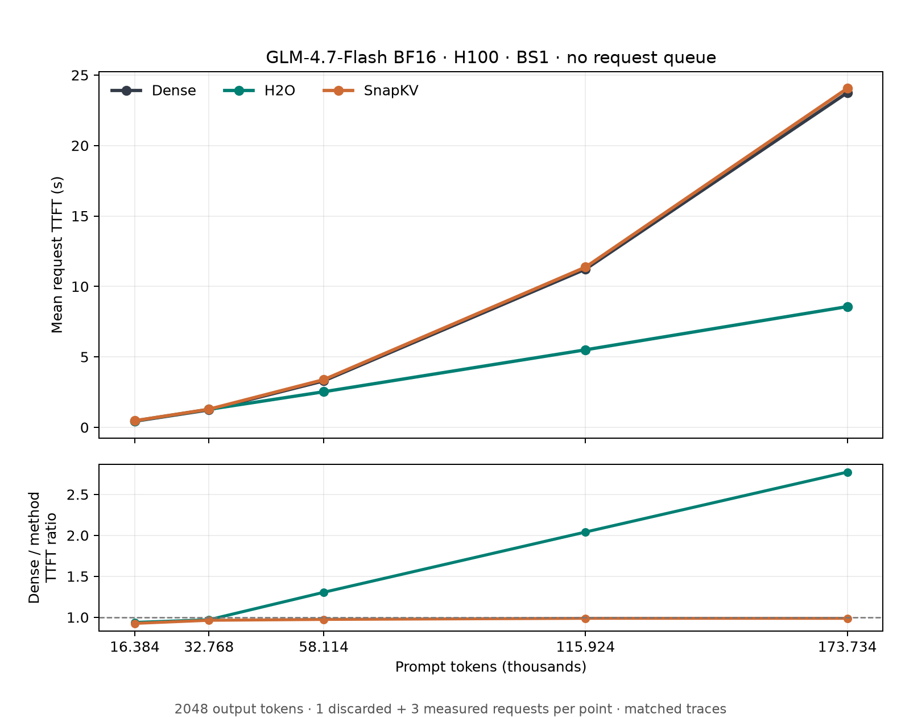

# GLM-4.7-Flash eviction methods: request TTFT by prompt length



These are **historical BS1 request measurements**, reaggregated from the completed
2026-09-18 BS1 logs. Each point has one discarded warmup workload and three
measured requests. TTFT is arrival to first token at the SparseEngine step
publication boundary; it is not HTTP client latency or isolated prefill kernel
time. The lower panel divides Dense TTFT by each method's TTFT, so values above
1 mean a shorter TTFT than Dense.

**This figure has no inter-request queue. It does not measure any TTFT benefit
from increased admission capacity or reduced queue waiting.**

| Prompt tokens | Dense TTFT (s) | H2O TTFT (s) | H2O vs Dense | SnapKV TTFT (s) |
| ---: | ---: | ---: | ---: | ---: |
| 16,384 | 0.433 | 0.462 | 0.94× | 0.468 |
| 32,768 | 1.238 | 1.277 | 0.97× | 1.286 |
| 58,114 | 3.295 | 2.525 | 1.30× | 3.384 |
| 115,924 | 11.227 | 5.502 | 2.04× | 11.369 |
| 173,734 | 23.751 | 8.569 | 2.77× | 24.056 |

H2O shortens TTFT from 58,114 tokens onward in this setup. At 173,734 tokens,
the measured reduction is 15.182 s (63.9%). SnapKV is slower than Dense at
all five lengths here. This is consistent with the recorded algorithms: H2O
evicts between prefill chunks, while this SnapKV configuration compacts at the
final prefill boundary. The first two inputs fit in one 32,768-token prefill
chunk; the longer inputs use multiple chunks. It does not establish that every H2O configuration or
model reduces TTFT, nor does it isolate eviction from scoring and other method
work. Both methods still processed every input token; H2O's later chunks can
attend over a shorter retained history.

## Measurement identity

- Model: GLM-4.7-Flash BF16; NVIDIA H100 80 GB; one GPU, TP1/EP1.
- Engine: SparseEngine Dense, H2O, and SnapKV under the same recorded commit
  `a276e3134c812ae524f95ff5ff31a1d8069210e2`.
- Fixed workload: input lengths above, 2,048 output tokens, BS1, seed 42,
  zero length jitter, greedy output, ignore EOS, prefix cache off.
- Runtime: `max_num_batched_tokens=32768`, prefill chunk size 32768, GPU memory
  fraction 0.90, decode CUDA Graph on; one warmup and three measured iterations.
- H2O: logits prefill scoring, prefill budget 8192, decode budget 4096,
  eviction interval 128. SnapKV: probability scoring, 64 sink + 512 recent +
  7616 selected tokens, score window 32.
- These are logged measurements from the recorded run, not a claim about the
  current worktree's speed.

The source campaign is
`/data2/haojitai/outputs/Sparse-vLLM/glm47-bf16-bs1-tp1-32kchunk-h100-20260918/`.
Each source point contains `run_status.json`, `run_manifest.json`,
`raw_samples.jsonl`, `request_samples.jsonl`, and `summary.json`. The
[CSV](ttft_data.csv) has the exact pooled TTFT means and quantiles and source
subdirectories. The renderer checks
success status, three complete requests per point, the measurement boundary,
input/output counts, protocol, source commit, and matching token traces across
methods. It reaggregates requests with `benchmark/efficiency/metrics.py` and
checks the stored summaries before drawing [PNG](ttft_vs_prompt.png) and
[SVG](ttft_vs_prompt.svg).

To regenerate without running a GPU workload, activate a Python environment
with matplotlib, then run from the repository root:

```bash
python scripts/official_experiments/glm47_eviction_ttft/render_ttft.py \
  --source-root "$RUN_ROOT" \
  --output-dir scripts/official_experiments/glm47_eviction_ttft
```

For a paper figure, label this as a **BS1 request TTFT comparison at fixed
prompt length**. The separate conservative-capacity experiment chooses a
different concurrency for each method and must not be used as a matched TTFT
speedup curve.
